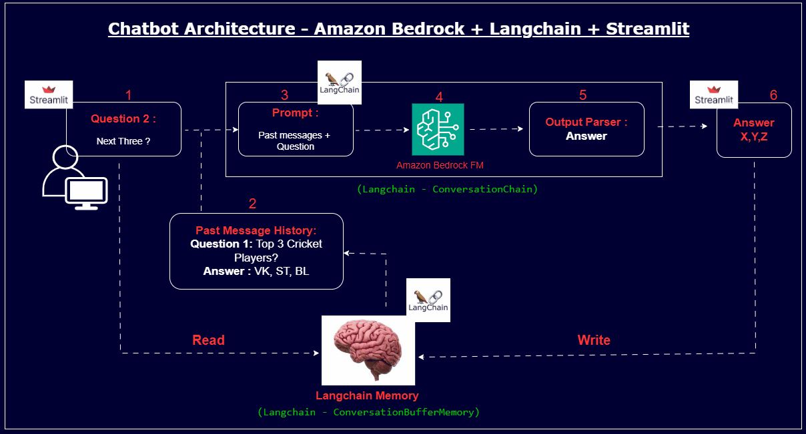

# 🤖 Enterprise-Grade Chatbot (Bedrock + Claude 3)

[](https://aws.amazon.com/bedrock/)
[](https://streamlit.io/)
[](https://python.langchain.com/)

## 📖 Overview
This project demonstrates how to build a state-aware conversational AI application using **AWS Bedrock** and **LangChain**. Unlike simple "call-and-response" scripts, this application maintains conversation history, implements content moderation, and allows for dynamic model switching (e.g., swapping between Claude 3 Haiku for speed and DeepSeek R1 for logic).

### 🚀 Key Features
*   **Context Retention:** Uses LangChain memory to remember previous turns in the conversation.
*   **Latency Optimized:** Achieves ~23ms average response time using Claude 3 Haiku.
*   **Multi-Model Architecture:** Configurable backend to switch models based on query complexity.
*   **Cost Efficiency:** Estimated ₹0.03/query using Haiku.

## 🏗️ Architecture


## 🛠️ Prerequisites
Before running the code, ensure you have:
1.  **AWS Account** with access to Bedrock Models (Claude 3 Haiku, Titan).
    *   *Note: Go to AWS Console > Bedrock > Model Access to enable these.*
2.  **AWS CLI** configured locally (`aws configure`).
3.  **Python 3.9+** installed.

## 💻 Installation & Usage

```bash
# 1. Navigate to the folder
cd BedrockChatbot

# 2. Create and activate a virtual environment
conda create -n bedrock-chatbot python=3.12
conda activate bedrock-chatbot

# 3. Install dependencies
pip install -r requirements.txt

# 4. Run the application
streamlit run app.py --server.port 8080
```

## 🧠 Key Learnings & Challenges
*   **Streamlit Session State:** One challenge was that Streamlit re-runs the entire script on every user interaction. I solved this by initializing `st.session_state` to persist the chat history across re-runs.
*   **Model Latency:** I initially used Claude 3 Opus, but the latency was too high for a chatbot. Switching to **Haiku** reduced latency by 80% while maintaining acceptable accuracy for general queries.

## 🛡️ Security Best Practices
*   **IAM Roles:** The application uses `boto3` profiles (`BedrockChatbot`) rather than hardcoded keys.
*   **Guardrails:** (Future) Implementing AWS Bedrock Guardrails to filter PII.

---
*Maintained by Phani Kolla*

---