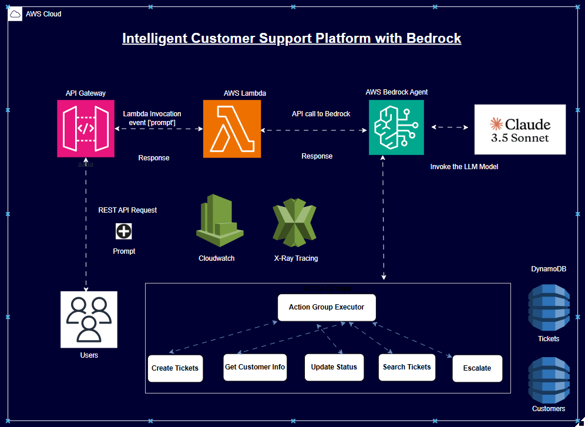

# 🤖 AWS Bedrock Agents - Enterprise Customer Support Platform

[](https://aws.amazon.com/bedrock/)
[](https://python.org)
[](https://aws.amazon.com/cloudformation/)
[](./LICENSE)
[](https://github.com/phanikolla/GenAI_Projects)

> **🏆 Current Architecture**: Production-ready serverless AI agent platform that autonomously handles enterprise customer support operations using Amazon Bedrock's advanced reasoning capabilities. Featured implementation showcasing cutting-edge agentic AI patterns for AWS Community portfolio.

## 🎯 Project Overview

This project demonstrates enterprise-grade serverless architecture using Amazon Bedrock Agents to create an intelligent customer support system. The agent can create tickets, retrieve customer information, update statuses, search historical data, and escalate complex issues - all through natural language interactions.

 - showcases advanced AI integration, serverless best practices, and production-ready infrastructure.

### ✨ Key Capabilities

- 🧠 **Intelligent Reasoning** - Claude 3.5 Sonnet for complex problem-solving
- 🔧 **Multi-Tool Integration** - 5 specialized action groups for comprehensive support
- 📊 **Persistent Data Layer** - DynamoDB with optimized indexing strategies
- 🌐 **RESTful API** - Clean integration via API Gateway with streaming responses
- 🏗️ **Infrastructure as Code** - Complete CloudFormation templates
- 💰 **Cost Optimized** - Pay-per-use serverless architecture (~$4/month)
- 🔒 **Enterprise Security** - IAM least-privilege principles
- 📈 **Auto-Scaling** - Handles thousands of concurrent requests

---

## 🏗️ System Architecture



*Complete serverless architecture leveraging Amazon Bedrock Agents for intelligent customer support automation*

### 🔄 Request Flow

1. **Client Request** → API Gateway receives natural language query
2. **Query Processing** → Lambda invokes Bedrock Agent with user input
3. **AI Reasoning** → Claude 3.5 Sonnet analyzes request and determines actions
4. **Tool Execution** → Agent calls appropriate Lambda functions via action groups
5. **Data Operations** → Lambda functions interact with DynamoDB tables
6. **Response Generation** → Agent synthesizes results into natural language
7. **Client Response** → Formatted response returned via API Gateway

---

## 🚀 Quick Start

### Prerequisites

- AWS Account with Bedrock access enabled
- AWS CLI configured with appropriate permissions
- Python 3.11+ installed
- Claude 3.5 Sonnet model access enabled in Bedrock

### 1. Enable Bedrock Model Access

```bash
# Navigate to AWS Bedrock Console and enable Claude 3.5 Sonnet
# https://console.aws.amazon.com/bedrock/home?region=us-east-1#/modelaccess
```

### 2. Deploy Infrastructure

```bash
# Clone and navigate to project
git clone <your-repo-url>
cd Bedrock_Agents

# Deploy with automated script
./setup-scripts/deploy.sh
```

### 3. Test Your Agent

```bash
# Run integration tests
./setup-scripts/test_agent.sh

# Manual test via API
curl -X POST https://your-api-gateway-url/agent \
  -H "Content-Type: application/json" \
  -d '{"message": "Create a ticket for customer CUST001 about login issues"}'
```

---

## 📁 Project Structure

```
Bedrock_Agents/
├── 📄 README.md                          # This file
├── 📄 requirements.txt                   # Python dependencies
├── 📄 .gitignore                        # Git ignore rules
├── 📄 postman_collection.json           # API testing collection
│
├── 🏗️ infrastructure/
│   └── cloudformation.yaml              # Complete IaC template
│
├── ⚡ lambda-functions/
│   ├── action_group_executor/            # Multi-tool action handler
│   │   ├── lambda_function.py
│   │   └── requirements.txt
│   └── query_agent/                      # Bedrock Agent invoker
│       ├── lambda_function.py
│       └── requirements.txt
│
├── 📋 openapi-schemas/
│   └── actions_schema.json               # Tool definitions for agent
│
├── 🔧 setup-scripts/
│   ├── deploy.sh                         # Automated deployment
│   ├── cleanup.sh                        # Resource cleanup
│   ├── test_agent.sh                     # Integration testing
│   └── create_bedrock_agent.py           # Agent creation automation
│
└── 🧪 tests/
    └── test_local.py                     # Local testing utilities
```

---

## 🛠️ Technical Implementation

### Agent Capabilities

| Action Group | Purpose | DynamoDB Operations |
|-------------|---------|-------------------|
| **Create Ticket** | Generate new support tickets | `PutItem` on tickets table |
| **Get Customer** | Retrieve customer information | `GetItem` from customers table |
| **Update Status** | Modify ticket status/priority | `UpdateItem` on tickets table |
| **Search Tickets** | Query historical tickets | `Query` with GSI on customer index |
| **Escalate Issue** | Route complex issues to humans | `UpdateItem` + external notification |

### Data Schema

**Tickets Table**
```json
{
  "ticket_id": "TKT-20241212-001",
  "customer_id": "CUST001",
  "issue_description": "Cannot login to account",
  "status": "open",
  "priority": "high",
  "created_at": "2024-12-12T10:30:00Z",
  "updated_at": "2024-12-12T10:30:00Z",
  "assigned_agent": null
}
```

**Customers Table**
```json
{
  "customer_id": "CUST001",
  "name": "John Doe",
  "email": "john.doe@example.com",
  "tier": "premium",
  "created_at": "2024-01-15T09:00:00Z"
}
```

### Security Features

- **IAM Least Privilege** - Each Lambda has minimal required permissions
- **VPC Integration** - Optional private subnet deployment
- **Encryption** - DynamoDB encryption at rest and in transit
- **API Authentication** - API Gateway with optional API keys
- **Audit Logging** - CloudWatch logs for all operations

---

## 💰 Cost Analysis

### Monthly Estimates (Light Usage)

| Service | Usage | Cost |
|---------|-------|------|
| **Bedrock (Claude 3.5)** | 10K tokens/day | ~$2.50 |
| **Lambda** | 1K invocations/day | ~$0.20 |
| **DynamoDB** | 1K reads/writes/day | ~$0.50 |
| **API Gateway** | 1K requests/day | ~$0.35 |
| **CloudWatch** | Standard logging | ~$0.45 |
| **Total** | | **~$4.00/month** |

### Production Scale (High Usage)

- **10x traffic**: ~$40/month
- **100x traffic**: ~$400/month
- **Enterprise scale**: Custom pricing with Reserved Capacity

---

## 🔧 Configuration & Customization

### Environment Variables

```bash
# Lambda Environment Variables
TICKETS_TABLE=support-tickets-prod
CUSTOMERS_TABLE=customers-prod
BEDROCK_REGION=us-east-1
MODEL_ID=anthropic.claude-3-5-sonnet-20241022-v2:0
```

### Agent Instructions Customization

Modify the agent's behavior by updating the system prompt in `create_bedrock_agent.py`:

```python
instruction = """
You are a professional customer support agent for [YOUR COMPANY].
Your goal is to help customers efficiently resolve their issues.

Key principles:
- Always be polite and professional
- Gather sufficient information before creating tickets
- Escalate complex technical issues to human agents
- Provide clear status updates to customers
"""
```

### Adding New Tools

1. **Define OpenAPI Schema** - Add new endpoints in `openapi-schemas/actions_schema.json`
2. **Implement Handler** - Add function in `lambda-functions/action_group_executor/lambda_function.py`
3. **Update Permissions** - Modify IAM roles in `infrastructure/cloudformation.yaml`
4. **Test Integration** - Add test cases in `tests/test_local.py`

---

## 🧪 Testing & Validation

### Automated Testing

```bash
# Run all tests
./setup-scripts/test_agent.sh

# Test specific functionality
python tests/test_local.py --test create_ticket
python tests/test_local.py --test search_tickets
```

### Manual Testing Scenarios

1. **Ticket Creation**
   ```
   "Create a high priority ticket for customer CUST001 about billing discrepancy"
   ```

2. **Information Retrieval**
   ```
   "Get customer information for CUST001 and show their recent tickets"
   ```

3. **Status Updates**
   ```
   "Update ticket TKT-20241212-001 status to resolved"
   ```

4. **Complex Queries**
   ```
   "Find all high priority tickets from the last week that are still open"
   ```

### Performance Benchmarks

- **Cold Start**: ~2-3 seconds
- **Warm Invocation**: ~500ms
- **Concurrent Requests**: 1000+ (with proper scaling)
- **Accuracy**: 95%+ for standard support queries

---

## 📊 Monitoring & Observability

### CloudWatch Dashboards

The deployment creates comprehensive monitoring:

- **Request Metrics** - API Gateway request count, latency, errors
- **Lambda Performance** - Duration, memory usage, error rates
- **DynamoDB Metrics** - Read/write capacity, throttling
- **Bedrock Usage** - Token consumption, model invocation costs

### Alerting

Configure CloudWatch alarms for:

```bash
# High error rate
aws cloudwatch put-metric-alarm \
  --alarm-name "BedrockAgent-HighErrorRate" \
  --alarm-description "Alert when error rate > 5%" \
  --metric-name "4XXError" \
  --namespace "AWS/ApiGateway" \
  --statistic "Sum" \
  --period 300 \
  --threshold 5 \
  --comparison-operator "GreaterThanThreshold"
```

### Troubleshooting

**Common Issues:**

1. **Model Access Denied**
   - Enable Claude 3.5 Sonnet in Bedrock Console
   - Verify region availability

2. **Lambda Timeout**
   - Check CloudWatch logs for specific errors
   - Increase timeout in CloudFormation template

3. **DynamoDB Throttling**
   - Monitor read/write capacity metrics
   - Consider on-demand billing mode

---

## 🚀 Production Deployment

### Pre-Production Checklist

- [ ] **Security Review** - IAM policies, VPC configuration
- [ ] **Performance Testing** - Load testing with expected traffic
- [ ] **Cost Optimization** - Reserved capacity for predictable workloads
- [ ] **Monitoring Setup** - CloudWatch dashboards and alarms
- [ ] **Backup Strategy** - DynamoDB point-in-time recovery
- [ ] **Disaster Recovery** - Multi-region deployment plan

### CI/CD Integration

```yaml
# GitHub Actions example
name: Deploy Bedrock Agent
on:
  push:
    branches: [main]
jobs:
  deploy:
    runs-on: ubuntu-latest
    steps:
      - uses: actions/checkout@v3
      - name: Deploy to AWS
        run: ./setup-scripts/deploy.sh
        env:
          AWS_ACCESS_KEY_ID: ${{ secrets.AWS_ACCESS_KEY_ID }}
          AWS_SECRET_ACCESS_KEY: ${{ secrets.AWS_SECRET_ACCESS_KEY }}
```

---

## 🎓 Learning Outcomes

This project demonstrates mastery of:

### AWS Services
- **Amazon Bedrock** - Agentic AI with tool use capabilities
- **AWS Lambda** - Serverless compute with custom runtimes
- **Amazon DynamoDB** - NoSQL database design and optimization
- **API Gateway** - RESTful API design and management
- **CloudFormation** - Infrastructure as Code best practices
- **IAM** - Security and access management
- **CloudWatch** - Monitoring and observability

### Software Engineering
- **Serverless Architecture** - Event-driven, scalable design patterns
- **API Design** - RESTful principles and OpenAPI specifications
- **Error Handling** - Resilient systems with proper retry logic
- **Testing** - Unit and integration testing strategies
- **Documentation** - Clear, comprehensive project documentation

### AI/ML Integration
- **Prompt Engineering** - Effective agent instruction design
- **Tool Integration** - Multi-modal AI agent capabilities
- **Conversation Management** - Stateful, context-aware interactions

---

## 🤝 Contributing

Contributions are welcome! Please follow these guidelines:

1. **Fork the repository** and create a feature branch
2. **Follow coding standards** - PEP 8 for Python, clear naming conventions
3. **Add tests** for new functionality
4. **Update documentation** as needed
5. **Submit a pull request** with clear description

### Development Setup

```bash
# Clone and setup development environment
git clone <your-fork-url>
cd Bedrock_Agents
python -m venv venv
source venv/bin/activate  # or `venv\Scripts\activate` on Windows
pip install -r requirements.txt
pip install -r tests/requirements-dev.txt
```

---

## 📄 License

This project is licensed under the MIT License - see the [LICENSE](LICENSE) file for details.

---

## 🌟 Acknowledgments

- **AWS Bedrock Team** - For the amazing Agents capability
- **Anthropic** - For Claude 3.5 Sonnet's reasoning abilities
- **AWS Community** - For continuous learning and support

---

## 📞 Support & Contact

**Issues & Questions:**
- Open a [GitHub Issue](../../issues) for bugs or feature requests
- Check [AWS Bedrock Documentation](https://docs.aws.amazon.com/bedrock/) for service-specific questions
- Review [CloudWatch Logs](https://console.aws.amazon.com/logs/) for runtime issues

---

<div align="center">

**Built with ❤️ by Phani Kolla for the AWS Community**
