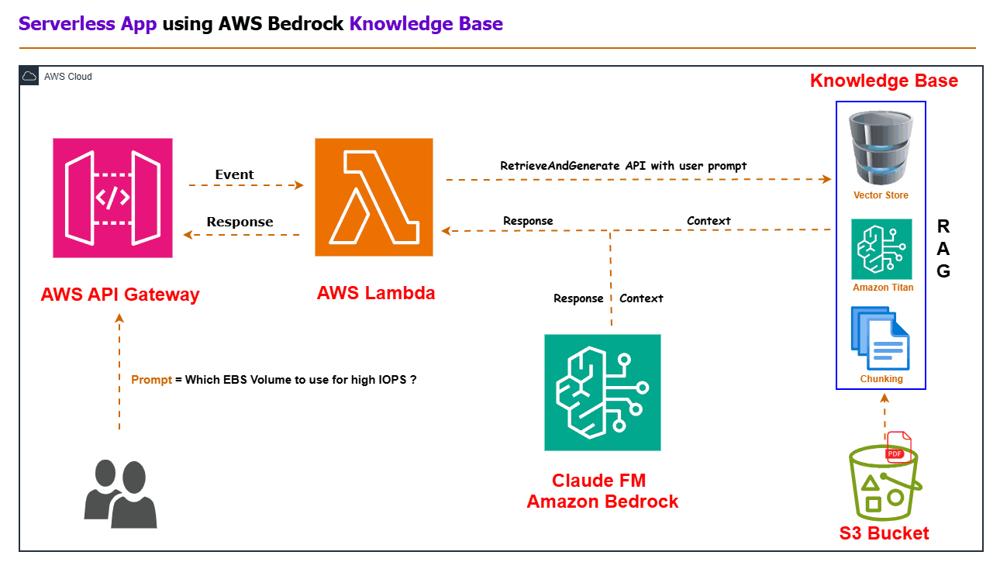

# L&D App using AWS Bedrock KnowledgeBase

## Project Overview

This project leverages AWS Bedrock KnowledgeBase to create an AI-powered Learning and Development (L&D) application. It demonstrates the integration of cloud-native architecture with generative AI to deliver personalized and adaptive learning experiences.

## Features

🚀 **Personalized Learning Paths**: Tailored content recommendations based on individual needs and learning styles

🧠 **Intelligent Knowledge Retrieval**: Accurate answers extracted directly from company documents in seconds

💬 **24/7 AI Learning Coach**: Conversational interface powered by Claude models for continuous guidance

🔍 **Multi-format Content Processing**: Seamlessly handles text, images, and complex document layouts

🔄 **Continuous Learning System**: Platform gets smarter with every interaction

## Technical Implementation

- **Amazon Bedrock**: Utilized KnowledgeBase, Titan Text Embedding, and Claude 2 models
- **AWS Lambda**: Implemented serverless computing for backend logic
- **S3 Bucket**: Used for storing and organizing training documents and multimedia content
- **AWS API Gateway**: Created secure API endpoints for frontend communication
- **Vector Store**: Deployed OpenSearch by AWS for efficient embedding retrieval

## 🌐 Architecture

## Setup and Deployment

1. Clone the repository:

git clone https://github.com/your-username/Gen_AI_Projects.git

cd Gen_AI_Projects/Knowledgebase_Project

2. Configure AWS credentials and region

3. Deploy the infrastructure:

# Add deployment commands here

4. Set up the client application:

# Add client setup instructions here

## Usage

Provide instructions on how to use the L&D app, including:
- How to upload content
- How to query the knowledge base
- How to access personalized learning paths

## Key Learnings

This project demonstrates that combining cloud-native architecture with generative AI creates learning experiences that are not just automated but truly adaptive and personalized. The most powerful L&D systems don't just deliver content - they understand context, user needs, and evolve over time.

## Future Enhancements

- Integration with existing LMS platforms
- Multi-language support
- Advanced analytics dashboard for learning progress

## Contributing

We welcome contributions to improve the L&D app. Please follow these steps:
1. Fork the repository
2. Create a new branch
3. Make your changes and commit them
4. Push to your fork and submit a pull request

## License

This project is licensed under the [MIT License](LICENSE).

## Contact

For any queries or suggestions, please open an issue or contact [Phani Kumar](mailto:pkkolla24@gmail.com).

---

Last updated: March 20, 2025
