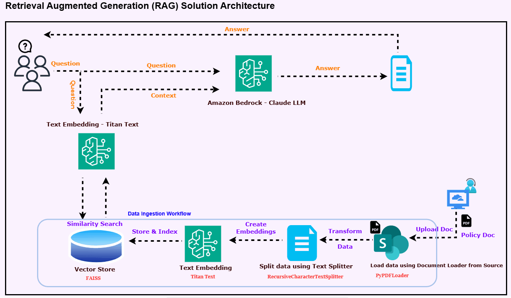

# RAG System for Document Question-Answering

Reteival Augmented Generation (RAG) system that enables efficient question-answering from large documents by connecting large language models with a custom knowledge base.

# Overview

This system processes, indexes, and retrieves information from extensive technical documentation to provide accurate, context-aware responses in milliseconds. By leveraging Amazon Bedrock's powerful models and FAISS vector store, it can handle documents that exceed standard LLM token limits.

## 🌐 Architecture

# Features

✨ Context-Aware Search: Understands complex queries beyond simple keyword matching

⚡ Real-Time Document Processing: Handles documents exceeding standard LLM token limits

🎯 Zero Hallucinations: Every response is grounded in source documents

📚 Source Attribution: Maintains citations for all information retrieved

🔄 Custom Query Optimization: Improves results with each interaction

👥 User-Friendly Interface: Streamlit-based UI accessible to non-technical users

# Technical Architecture

The system follows this workflow:

Document ingestion and chunking

Embedding generation using Amazon Bedrock's Titan model

Vector storage in FAISS database

Query processing and context retrieval

Response generation using Claude 2 model

Presentation through Streamlit interface

# Prerequisites

Python 3.9+

AWS account with Amazon Bedrock access

Required Python packages (listed in requirements.txt)

# Installation

# Clone repository
git clone https://github.com/yourusername/Gen_AI_Projects.git
cd Gen_AI_Projects/RAG_Project

# Create virtual environment
python -m venv venv
source venv/bin/activate  # On Windows: venv\Scripts\activate

# Install dependencies
pip install -r requirements.txt

# Configure AWS credentials
aws configure

# Implementation Steps

1. Import Required Libraries
2. Define Data Source and Load Data
3. Split Text into Chunks
4. Create Embeddings
5. Create Vector Database and Index
6. Connect to LLM and Create Search Function

# Run the application:

streamlit run app.py

# Key Learnings

RAG systems overcome token limitations of traditional LLMs for document processing

Vector embeddings effectively capture semantic relationships for better retrieval

Proper chunking strategies are crucial for maintaining context during retrieval

LLM response quality depends heavily on context quality and prompt engineering

AWS Bedrock provides enterprise-grade AI capabilities with customizable models

# Future Improvements

Implement multi-document support for cross-referencing information

Add document caching for improved performance

Create evaluation metrics to assess retrieval quality

Incorporate user feedback loop for continuous improvement

Extend to handle different document formats (DOCX, HTML, etc.)

# License

This project is licensed under the MIT License - see the LICENSE file for details.
