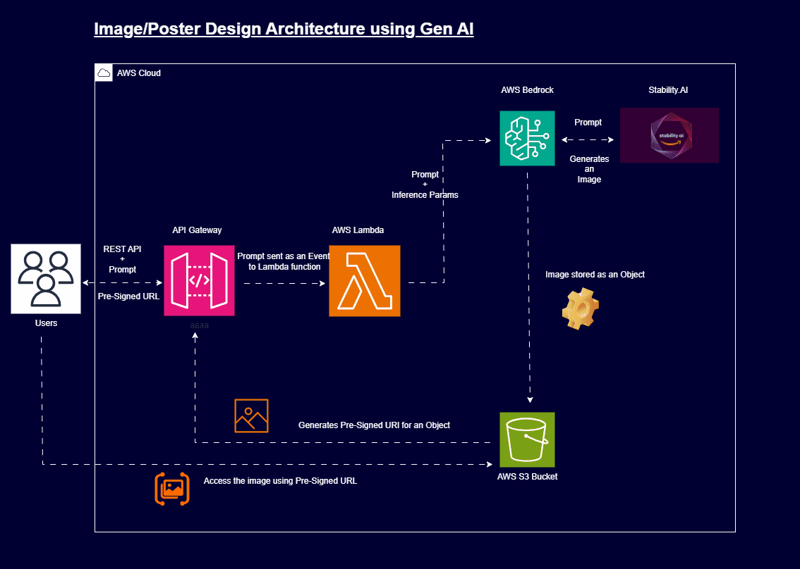

# Gen AI Projects Repository

Welcome to the **Gen AI Projects Repository**! This repository is dedicated to showcasing various generative AI projects built using cutting-edge technologies like Amazon Bedrock, Stability AI, LangChain, Llama 2, and more. Each project leverages serverless architectures and modern tools to solve real-world problems efficiently.

---

## Current Projects

### 1. **Image Generation using Amazon Bedrock**
   - **Description**: Generate stunning images from text prompts using Stability AI's Stable Diffusion model hosted on AWS Bedrock.
   - **Status**: ✅ Completed
   - **Technologies**: API Gateway, Lambda, Amazon Bedrock, S3, CloudWatch
   - **Details**: https://github.com/phanikolla/GenAI_Projects/tree/main/Image_Generation
     
### 2. **Text Summarization**
   - **Description**: Build a serverless API to summarize long-form text using generative AI models.
   - **Status**: ✅ Completed
   - **Technologies**: Amazon Bedrock, Lambda, API Gateway
   - **Details**: https://github.com/phanikolla/GenAI_Projects/tree/main/Text%20Summarization
---

## Upcoming Projects

### 3. **Building a Chatbot with Llama 3, LangChain, and Streamlit**
   - **Description**: Create an interactive chatbot powered by Llama 3 and LangChain, with a user-friendly interface built in Streamlit.
   - **Technologies**: Llama 3, LangChain, Streamlit

### 4. **HR Q&A with Retrieval Augmented Generation (RAG)**
   - **Description**: Develop an HR assistant capable of answering employee-related questions using RAG techniques.
   - **Technologies**: Amazon Bedrock, LangChain, S3

### 5. **Serverless E-Learning App**
   - **Description**: Build an e-learning platform with a knowledge base for personalized learning experiences.
   - **Technologies**: Lambda, API Gateway, S3

### 6. **Building AGENTS with Bedrock Agents and Knowledgebase**
   - **Description**: Create intelligent agents that can perform tasks autonomously using Bedrock Agents and a custom knowledge base.
   - **Technologies**: Amazon Bedrock Agents, S3

### 7. **Marketing Manager Application with Amazon Q Business**
   - **Description**: Develop an AI-powered marketing manager to generate insights and strategies for campaigns.
   - **Technologies**: Amazon Q Business, Lambda

---

## How to Use This Repository

1. Clone the repository: https://github.com/phanikolla/GenAI_Projects.git
2. Navigate to the specific project folder for setup instructions.

---

## Architecture Example

Here’s the architecture diagram for the completed *Image Generation* project:

---

## Contributing

Contributions are welcome! If you have ideas or improvements for any of the projects listed above:
- Fork this repository
- Submit a pull request
- Open an issue for discussion

---

## License

This repository is licensed under the MIT License. See [LICENSE](./LICENSE) for details.

---

## Contact

Feel free to connect for collaboration or inquiries:

- **LinkedIn**: [My LinkedIn Profile](https://www.linkedin.com/in/phanikumarkolla/)
- **GitHub**: [My GitHub Profile](https://github.com/phanikolla)

---

