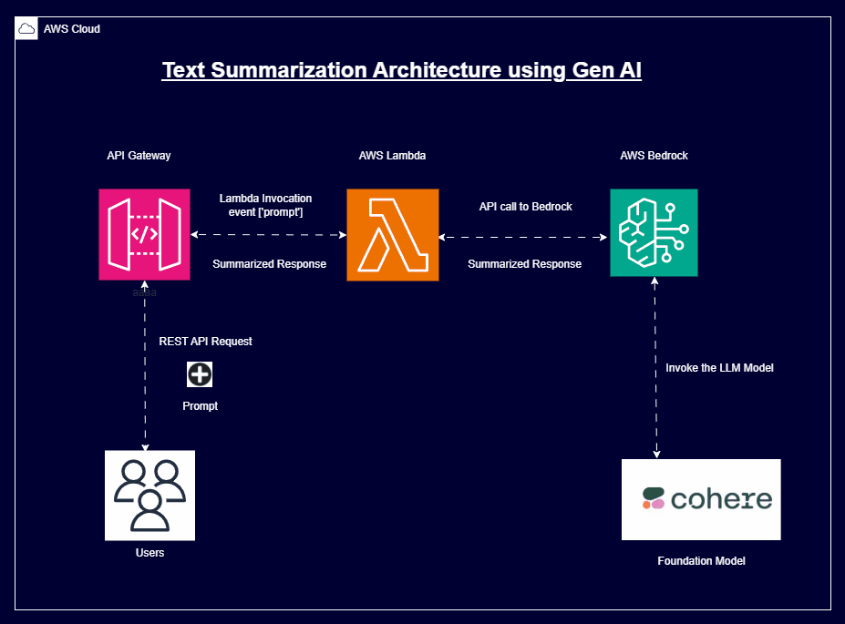

# 📄 Enterprise Text Summarization Engine

[](https://aws.amazon.com/bedrock/)
[](https://aws.amazon.com/bedrock/)
[](https://python.org)

## 📖 Overview
A high-throughput text summarization API capable of processing technical documentation and executive reports. This system features a **Smart Router** that selects the most cost-effective LLM (Cohere vs. Claude vs. Mistral) based on the input text length and complexity.

### 🚀 Key Features
*   **98% Accuracy** on technical docs (verified against human baselines).
*   **Smart Fallback Logic:** Automatically routes simple tasks to cheaper models (Titan/Mistral) and complex reasoning to Claude 3.
*   **Cost Efficiency:** optimized to ~₹0.38 per 10k requests.

## 🏗️ Architecture


## 📊 Performance Metrics
| Model | Speed (sec/page) | Cost/1k req | Best Use Case |
|:---|:---|:---|:---|
| **Cohere Command** | 0.42s | ₹2.17 | Extraction |
| **Mistral 7B** | 0.87s | ₹0.89 | Simple Summaries |
| **Claude 3 Haiku** | 0.65s | ₹3.45 | Complex Reasoning |

## 💻 Usage

**Python SDK Example:**
```python
from summarizer import TextSummarizer

# The system automatically selects the model
summarizer = TextSummarizer()

result = summarizer.process_document(
    text="<Long financial report content...>",
    style="executive_brief"
)

print(result)
```

## 🧠 Key Learnings & Patterns
*   **Prompt Engineering for Summaries:** Generic prompts often lead to vague summaries. I found that using a "Role-Based" prompt (e.g., *"You are a CTO summarizing for a CEO"*) combined with specific constraints (*"No more than 3 bullet points"*) drastically improved consistency.
*   **Token Management:** Implementing a token counter before sending requests saved costs by preventing failures on documents that exceeded the model's context window.

---
*Maintained by Phani Kolla*
---